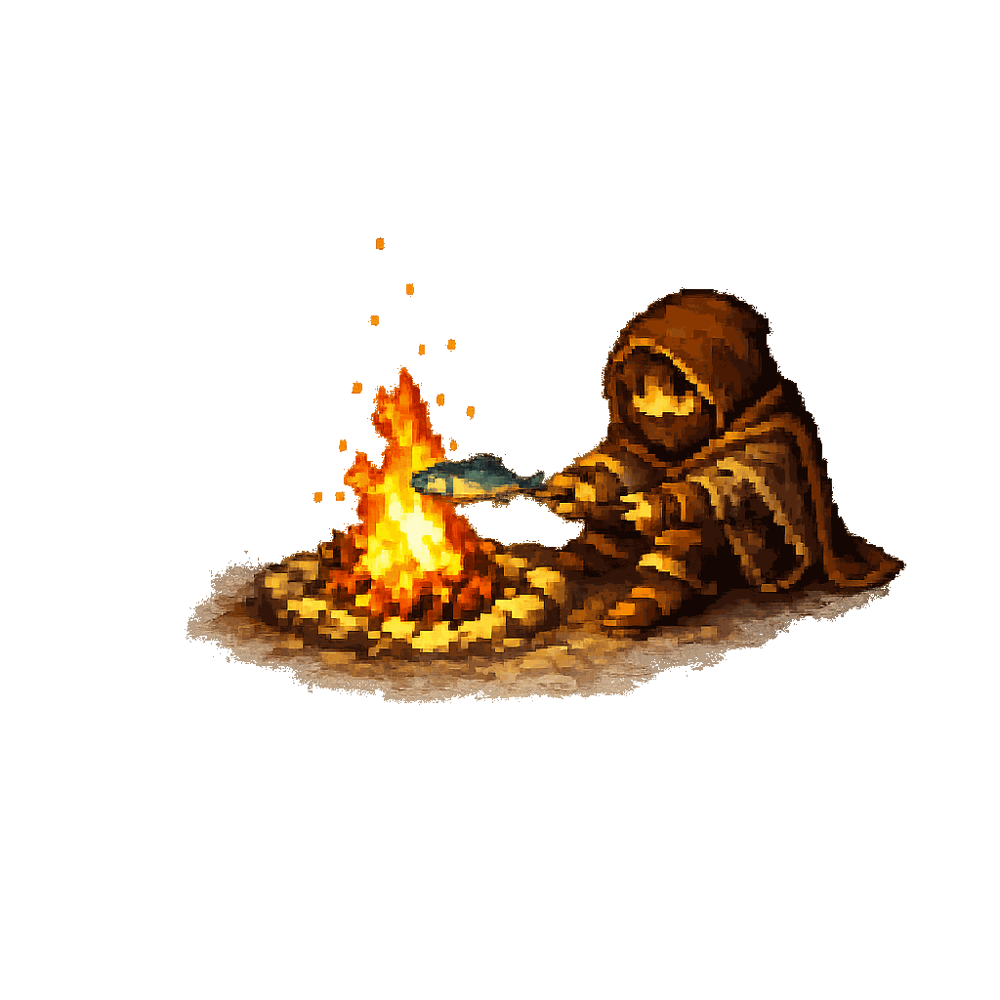

# Hello, I'm Athulya Weerakoon

I'm a Computer Science and Engineering undergraduate from the University of Jaffna, Sri Lanka, interested in building software that is useful, understandable, and steady under real-world pressure.

My work has moved through Open Banking platforms at WSO2, cloud and DevOps systems, secure API flows, Rust tooling, LLM-powered applications, and the occasional FPGA game. I enjoy careful engineering: understanding how systems behave, where they break, and how to make them simpler, safer, and easier to reason about.

These days, I am especially drawn toward security engineering, platform work, backend systems, and thoughtful software design. I like technical conversations, practical experiments, and projects that leave the codebase a little clearer than they found it.

You can find my portfolio, projects, writing, and CV here:

- Portfolio: [athulyaweerakoon.github.io](https://athulyaweerakoon.github.io)
- GitHub: [@AthulyaWeerakoon](https://github.com/AthulyaWeerakoon)
- Medium: [@athulyaweerakoon](https://medium.com/@athulyaweerakoon)

Welcome, and feel free to stroll around my GitHub profile.

  

